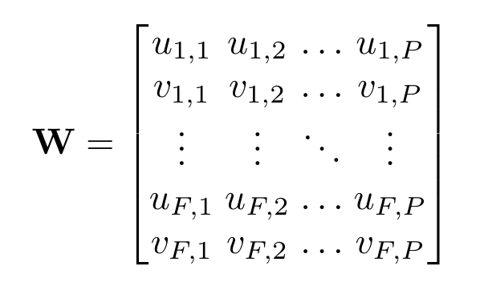

# When to Use CNNs for Inverse Problems
This repository contains a summary of, and in the future code for, the methods described in "Trajectory Space NRSfM Revisited".

Paper: TBA

## Abstract

The Non-Rigid Structure from Motion (NRSfM) problem is traditionally divided into shape or trajectory based methods. Shape based methods have seen the most interest, and have yielded in general the best results. In this work we argue that some of the advantages of trajectory based methods have not been fully utilized. One inherent advantage is that a fixed trajectory dictionary can be used regardless of the type of object being imaged. We leverage this to apply supervised learning to the NRSfM task in a way that can generalize to new object types. Additionally we observe that as a result of this unified representation, trajectories can be invariant to a much wider array of transformations than shapes. We use this observation to define a new factorization for NRSfM which yields a simpler optimization than previous approaches. We find that this setup of the problem combined with recent advancements in learning hierarchical sparse models yields a flexible NRSfM method that gives significantly better performance than state of the art methods.

## Problem Statement

In the NRSfM problem we are given a data matrix

which contains 2D tracks of *P* points over *F* frames. The goal of NRSfM is to take **W** and decompose it into the motion of the camera which imaged the scene, and the motion of the tracked points in 3D space. If we assume that the cameras follow an orthogonal projection model and that the mean column vector of **W** has been removed, then we can write the data matrix as:

The goal of NRSfM is to recover **M** and **S** simultaneously from **W**

## Summary

As illustrated above, a central idea of this paper is the fact that trajectories offer a unified model of non-rigid deformation. As shown on the left, shape based representation defines a separate space of deformation for each type of object. This is true even for sequences such as Walking and Dance which we know semantically both belong to the space of human deformations, but must be kept separate due to different numbers and positions of markers. We use this fact to perform supervised training of our trajectory model which can then be trasfered to datasets which are not suitable for learning.

Our trajectory model is based on the one introduced in [https://arxiv.org/abs/2003.13820]("When to use CNNs for Inverse Problems"). We extend the ideas by also optimizing over the camera matricies. Please consult the paper for a full descitpion of this optimization procudure. Below you can see some gifs demonstrating the results as compared to the previous trajectory based NRSfM.

 

